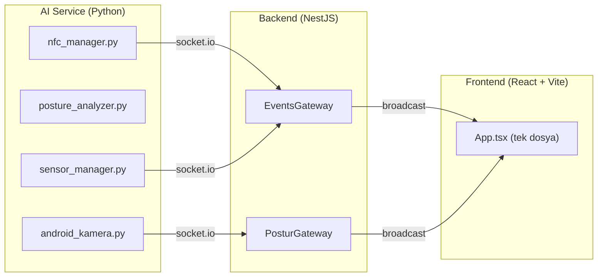
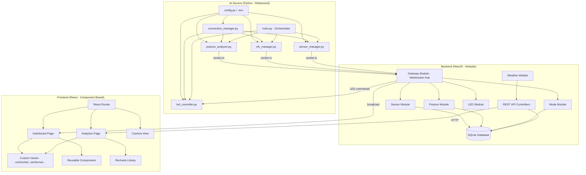

# Zenith Smart Room – Kapsamlı Analiz & Uygulama Planı

## 📋 Mevcut Durum Analizi

### Proje Mimarisi (Şu An)



---

## 🔴 Tespit Edilen Sorunlar

### AI Service Sorunları

| # | Dosya | Sorun | Seviye |
|---|-------|-------|--------|
| 1 | `android_kamera.py` | `posture_analyzer.py` ile **aynı işi yapıyor** – kod tekrarı (DRY ihlali) | 🔴 Kritik |
| 2 | `android_kamera.py` | Socket bağlantısı global scope'da yapılıyor – bağlantı hatası tüm uygulamayı çökertebilir | 🔴 Kritik |
| 3 | `android_kamera.py` | IP kamera adresi **hardcoded** (`192.168.6.28:4747`) – config'den okunmalı | 🟡 Orta |
| 4 | `android_kamera.py` | Her frame'de `sio.emit()` yapıyor – saniyede 30 mesaj backend'i boğar | 🔴 Kritik |
| 5 | `posture_analyzer.py` | `cv2.VideoCapture(0)` kullanıyor ama proje IP kamera kullanıyor – tutarsızlık | 🟡 Orta |
| 6 | `nfc_manager.py` | Kart ID'leri **hardcoded** – config dosyasına taşınmalı | 🟡 Orta |
| 7 | `nfc_manager.py` | Hata yönetimi zayıf – bare `except` yok ama SPI hatalarını yakalamıyor | 🟡 Orta |
| 8 | `sensor_manager.py` | I2C port **hardcoded** (`port = 3`) | 🟡 Orta |
| 9 | **Genel** | LED kontrol kodu **yok** – WS2812B strip için neopixel/rpi_ws281x entegrasyonu eksik | 🔴 Kritik |
| 10 | **Genel** | Her Python modülü **kendi socket bağlantısını kuruyor** – ortak bir bağlantı yöneticisi yok (SRP ihlali) | 🔴 Kritik |
| 11 | **Genel** | `.env` veya `config.py` dosyası yok – tüm ayarlar kodun içinde | 🟡 Orta |

### Backend Sorunları

| # | Dosya | Sorun | Seviye |
|---|-------|-------|--------|
| 1 | `postur.gateway.ts` + `events.gateway.ts` | **İki ayrı WebSocket Gateway** var ama ikisi de aynı CORS ayarıyla çalışıyor – birleştirilebilir veya modüler hale getirilebilir | 🟡 Orta |
| 2 | `postur.gateway.ts` | `console.log` kullanıyor, `events.gateway.ts` ise NestJS `Logger` kullanıyor – tutarsız logging | 🟡 Orta |
| 3 | **Genel** | **Veritabanı yok** – sensör verileri, postür geçmişi, mod değişimleri hiçbir yere kaydedilmiyor | 🔴 Kritik |
| 4 | **Genel** | REST API endpoint'i yok – sadece WebSocket var, geçmiş veri sorgulanamıyor | 🔴 Kritik |
| 5 | **Genel** | Hava durumu servisi yok – frontend'de **hardcoded** "İzmir, 22°C" | 🟡 Orta |
| 6 | `main.ts` | CORS ayarı yok – REST API eklendiğinde sorun çıkacak | 🟡 Orta |
| 7 | **Genel** | LED kontrol event'leri backend'den geçmiyor – AI servisine komut gönderecek kanal yok | 🔴 Kritik |
| 8 | **Genel** | Modül yapısı flat – `sensor`, `posture`, `nfc`, `led`, `weather` gibi modüller olmalı | 🟡 Orta |

### Frontend Sorunları

| # | Dosya | Sorun | Seviye |
|---|-------|-------|--------|
| 1 | `App.tsx` | **Tek bir dosyada her şey** – 134 satır, component yok, routing yok | 🔴 Kritik |
| 2 | `App.tsx` | Socket bağlantısı **global scope'da** – component dışında `io()` çağrılıyor | 🔴 Kritik |
| 3 | `App.css` | Vite boilerplate CSS'i – proje ile **hiç ilgisi yok** | 🟡 Orta |
| 4 | `App.tsx` | Tailwind utility class'ları ile styling – inline style gibi okunması zor | 🟡 Orta |
| 5 | `App.tsx` | Hava durumu **statik** – API bağlantısı yok | 🟡 Orta |
| 6 | **Genel** | Chart/analiz sayfası **yok** | 🔴 Kritik |
| 7 | **Genel** | Routing **yok** – tek sayfa | 🔴 Kritik |
| 8 | **Genel** | 7 inç ekrana optimize **değil** – responsive tasarım eksik | 🔴 Kritik |
| 9 | **Genel** | Kamera görüntüsü gösterimi yok | 🟡 Orta |
| 10 | **Genel** | Dark mode / premium tasarım yok | 🔴 Kritik |

---

## 🏗️ Hedef Mimari



---

## User Review Required

> [!IMPORTANT]
> **TailwindCSS Kararı**: Mevcut projede TailwindCSS v4 kurulu. Siz "frontend komple değişecek" dediniz. İki seçenek var:
> 1. **TailwindCSS ile devam** – Mevcut setup'ı koruyarak yeni tasarımı Tailwind ile yaparız
> 2. **Vanilla CSS'e geç** – Tailwind'i kaldırıp tamamen custom CSS ile yaparız (daha fazla kontrol, daha az bağımlılık)
> 
> Hangisini tercih edersiniz?

> [!IMPORTANT]
> **Veritabanı Seçimi**: Raspberry Pi'de çalışacağı için hafif bir DB öneriyorum:
> - **SQLite** (önerim) – dosya tabanlı, kurulum gerektirmez, Pi için ideal
> - **PostgreSQL** – daha güçlü ama Pi'de kaynak tüketimi fazla
> 
> SQLite ile devam edebilir miyiz?

> [!WARNING]
> **Hava Durumu API'si**: OpenWeatherMap ücretsiz API key gerektirir (1000 istek/gün). API key'iniz var mı? Yoksa oluşturmamız gerekecek. Alternatif olarak hangi şehir için kullanacağız? (İzmir mi?)

## Open Questions

> [!IMPORTANT]
> 1. **NFC Kart ID'leri**: Şu an kodda örnek ID'ler var. Gerçek kart ID'lerinizi biliyor musunuz? Kaç modunuz olacak? (Şu an CODING, FOCUS, RELAX, MEETING var)
> 2. **LED Strip**: WS2812B mi kullanıyorsunuz? GPIO pin numarası nedir? (Genellikle GPIO18)
> 3. **Kamera Stream**: Telefonu IP kamera olarak kullandığınızda, IP kamera uygulaması hangisi? (DroidCam, IP Webcam vb.) Frontend'de canlı görüntü göstermek için stream URL'si lazım.
> 4. **MQ135 + ADS1115**: "Beklemede" dediniz – bunları şimdi entegre edelim mi yoksa sadece altyapıyı hazırlayıp ileride mi aktif edelim?

---

## Proposed Changes

### Faz 1: AI Service Refactoring (Python)

#### [NEW] [config.py](file:///c:/Users/MrMahirr/Desktop/zenith-workspace/ai-service/config.py)
- Tüm hardcoded değerleri tek dosyada toplama
- IP kamera URL, socket server adresi, I2C port, GPIO pin numaraları
- NFC kart → mod eşleştirme tablosu
- `.env` desteği (`python-dotenv`)

#### [NEW] [connection_manager.py](file:///c:/Users/MrMahirr/Desktop/zenith-workspace/ai-service/connection_manager.py)
- Singleton socket.io bağlantı yöneticisi
- Otomatik yeniden bağlanma (reconnect) mantığı
- Tüm modüller bu tek bağlantıyı paylaşacak

#### [MODIFY] [posture_analyzer.py](file:///c:/Users/MrMahirr/Desktop/zenith-workspace/ai-service/posture_analyzer.py)
- Class-based yapıya dönüştürme
- IP kamera desteği (config'den URL okuma)
- Throttle mekanizması (her frame'de değil, durum değiştiğinde emit)
- `android_kamera.py` ile birleştirme (tek dosya)

#### [DELETE] [android_kamera.py](file:///c:/Users/MrMahirr/Desktop/zenith-workspace/ai-service/android_kamera.py)
- `posture_analyzer.py` ile birleştirilecek – tekrar eden dosya silinecek

#### [MODIFY] [nfc_manager.py](file:///c:/Users/MrMahirr/Desktop/zenith-workspace/ai-service/nfc_manager.py)
- Config'den kart ID'lerini okuma
- Connection manager kullanma
- LED renk geçişi tetikleme (mod değişiminde)

#### [MODIFY] [sensor_manager.py](file:///c:/Users/MrMahirr/Desktop/zenith-workspace/ai-service/sensor_manager.py)
- Config'den I2C ayarlarını okuma
- Connection manager kullanma
- MQ135/ADS1115 için altyapı hazırlama (şimdilik placeholder)

#### [NEW] [led_controller.py](file:///c:/Users/MrMahirr/Desktop/zenith-workspace/ai-service/led_controller.py)
- WS2812B LED strip kontrolü (`rpi_ws281x` kütüphanesi)
- 55 LED'in yönetimi
- Mod renkleri: CODING=yeşil, FOCUS=mavi, RELAX=amber, MEETING=kırmızı, PASSIVE=beyaz
- Kambur durumda → LED'ler kırmızı yanacak
- Mod geçişinde → 5 saniyelik o modun renginde animasyon
- Socket üzerinden backend'den komut alacak

#### [NEW] [main.py](file:///c:/Users/MrMahirr/Desktop/zenith-workspace/ai-service/main.py)
- Tüm servisleri başlatan orchestrator
- Her servis ayrı thread'de çalışacak
- Graceful shutdown yönetimi

---

### Faz 2: Backend Restructuring (NestJS)

#### [MODIFY] [main.ts](file:///c:/Users/MrMahirr/Desktop/zenith-workspace/backend/src/main.ts)
- CORS ayarı ekleme
- Global prefix (`/api`)
- ValidationPipe ekleme

#### [MODIFY] [app.module.ts](file:///c:/Users/MrMahirr/Desktop/zenith-workspace/backend/src/app.module.ts)
- TypeORM + SQLite entegrasyonu
- Tüm yeni modüllerin import'u
- ScheduleModule (periyodik görevler için)

#### [NEW] Backend Database Module
- `src/database/entities/sensor-reading.entity.ts` – sıcaklık, nem, basınç kayıtları
- `src/database/entities/posture-event.entity.ts` – kambur/düzgün duruş event'leri
- `src/database/entities/mode-change.entity.ts` – mod değişim geçmişi

#### [MODIFY] [events.gateway.ts](file:///c:/Users/MrMahirr/Desktop/zenith-workspace/backend/src/events/events.gateway.ts) → `gateway.module.ts`
- Tek bir WebSocket Gateway'e birleştirme
- Postur gateway'i buraya taşıma
- LED komut kanalı ekleme (`led_command` event)
- Her gelen veriyi DB'ye kaydetme

#### [DELETE] [postur.gateway.ts](file:///c:/Users/MrMahirr/Desktop/zenith-workspace/backend/src/postur/postur.gateway.ts)
- Events gateway ile birleştirilecek

#### [NEW] Backend Sensor Module
- `src/sensor/sensor.module.ts`
- `src/sensor/sensor.service.ts` – sensör verilerini DB'ye yazma
- `src/sensor/sensor.controller.ts` – REST API: `GET /api/sensors/history?range=24h`

#### [NEW] Backend Posture Module
- `src/posture/posture.module.ts`
- `src/posture/posture.service.ts` – postür event'lerini DB'ye yazma
- `src/posture/posture.controller.ts` – REST API: `GET /api/posture/history?range=24h`

#### [NEW] Backend Mode Module
- `src/mode/mode.module.ts`
- `src/mode/mode.service.ts` – mod değişimlerini DB'ye yazma, LED komutunu tetikleme
- `src/mode/mode.controller.ts` – REST API: `GET /api/modes/history`

#### [NEW] Backend Weather Module
- `src/weather/weather.module.ts`
- `src/weather/weather.service.ts` – OpenWeatherMap API'den hava durumu çekme (cache'li, her 30 dk güncelleme)
- `src/weather/weather.controller.ts` – REST API: `GET /api/weather`

---

### Faz 3: Frontend Complete Redesign

#### Tasarım Konsepti

Dashboard Layout (7 inç / 1024×600):

```
┌──────────────────────────────────────────────────┐
│ [🟢 CODING MODU]     [⚠ DURUŞ]     [☀ İzmir 22°]│
│   sol üst              orta üst       sağ üst     │
│                                                    │
│              ╔═══════════════════╗                 │
│              ║    14:23          ║                 │
│              ║  25 Nisan Cuma    ║                 │
│              ╚═══════════════════╝                 │
│                  ortada saat                       │
│                                                    │
│  [🌡 24.5°C]    [💧 %62]    [💨 İyi]    [📊]     │
│   sıcaklık        nem      hava kal.   chart→     │
└──────────────────────────────────────────────────┘
```

#### Teknoloji Seçimi
- **React Router** – sayfa geçişleri (Dashboard ↔ Analytics ↔ Camera)
- **Recharts** – chart kütüphanesi (lightweight, React-native)
- **Vanilla CSS** veya **Tailwind** (kullanıcı seçimine göre)
- **Custom hooks** – `useSocket`, `useSensorData`, `usePosture`, `useWeather`

#### [MODIFY] [index.html](file:///c:/Users/MrMahirr/Desktop/zenith-workspace/frontend/index.html)
- Meta tags, SEO, Google Fonts (Inter/JetBrains Mono)
- Title: "Zenith Dashboard"

#### [NEW] Frontend Routing Setup
- `src/router.tsx` – React Router konfigürasyonu
- Routes: `/` (Dashboard), `/analytics` (Charts), `/camera` (Camera View)

#### [NEW] Frontend Hooks
- `src/hooks/useSocket.ts` – Socket.io bağlantı yönetimi (singleton)
- `src/hooks/useSensorData.ts` – Sensör verileri state yönetimi
- `src/hooks/usePosture.ts` – Postür analizi state yönetimi
- `src/hooks/useMode.ts` – Aktif mod state yönetimi
- `src/hooks/useWeather.ts` – Hava durumu verisi (REST API'den)
- `src/hooks/useClock.ts` – Saat state'i

#### [NEW] Frontend Components
- `src/components/Clock/Clock.tsx` – Büyük dijital saat + tarih
- `src/components/ModeIndicator/ModeIndicator.tsx` – Aktif mod badge'i (renkli)
- `src/components/PostureAlert/PostureAlert.tsx` – Kambur/düzgün uyarısı (tıklanabilir → kamera)
- `src/components/WeatherWidget/WeatherWidget.tsx` – Hava durumu kartı
- `src/components/SensorCard/SensorCard.tsx` – Tekil sensör kartı (sıcaklık, nem, hava kalitesi)
- `src/components/SensorBar/SensorBar.tsx` – Alt bölge sensör kartları container'ı

#### [NEW] Frontend Pages
- `src/pages/Dashboard/Dashboard.tsx` – Ana dashboard sayfası
- `src/pages/Analytics/Analytics.tsx` – Chart'lı analiz sayfası (Recharts)
  - Sıcaklık grafiği (son 24 saat)
  - Nem grafiği
  - Postür zaman çizelgesi (kambur süreleri)
  - Mod kullanım pie chart
- `src/pages/Camera/Camera.tsx` – Canlı kamera stream görünümü

#### [MODIFY] [App.tsx](file:///c:/Users/MrMahirr/Desktop/zenith-workspace/frontend/src/App.tsx)
- Komple yeniden yazılacak
- Router wrapper olacak
- Socket provider context

#### Tasarım Özellikleri
- **Dark mode** ana tema (koyu gradient arka plan)
- **Glassmorphism** kartlar (`backdrop-blur`, `bg-white/5`, `border-white/10`)
- **Mod renkleri**: 
  - CODING → `#10B981` (emerald glow)
  - FOCUS → `#3B82F6` (blue glow)
  - RELAX → `#F59E0B` (amber glow)
  - MEETING → `#EF4444` (red glow)
  - PASSIVE → `#94A3B8` (slate)
- **Micro-animasyonlar**: Pulse efektleri, smooth geçişler, glow efektleri
- **7 inç optimize**: Büyük fontlar, touch-friendly butonlar, 1024×600'e özel breakpoint

---

### Faz 4: LED Entegrasyonu

#### LED Davranış Tablosu

| Olay | LED Davranışı | Süre |
|------|--------------|------|
| Kambur duruş algılandı | Tüm 55 LED **kırmızı** yanar | Kambur durduğu sürece |
| Düzgün duruşa geçiş | LED'ler söner / yeşil flash | 2 saniye |
| Mod değişimi (NFC) | O modun renginde **dalga animasyonu** | 5 saniye |
| CODING modu aktif | Hafif yeşil ambient glow | Sürekli |
| FOCUS modu aktif | Hafif mavi ambient glow | Sürekli |
| RELAX modu aktif | Sıcak amber ambient glow | Sürekli |
| MEETING modu aktif | Hafif kırmızı ambient glow | Sürekli |
| PASSIVE modu | LED'ler kapalı veya çok hafif beyaz | Sürekli |

---

## Verification Plan

### Automated Tests
1. **Backend**: `npm run test` – NestJS unit testleri
2. **Backend Build**: `npm run build` – TypeScript derleme kontrolü
3. **Frontend Build**: `npm run build` – Vite build kontrolü
4. **Database**: SQLite bağlantı ve CRUD testleri
5. **REST API**: `curl` ile endpoint testleri

### Manual Verification
1. **Dashboard UI**: Browser'da 1024×600 viewport ile test (Pi ekranı simülasyonu)
2. **Responsive**: Masaüstü tarayıcıda tam ekran test
3. **WebSocket**: Socket bağlantısı ve veri akışı kontrolü
4. **Charts**: Analytics sayfasında mock veri ile grafik render kontrolü

### Raspberry Pi Üzerinde Test (Kullanıcı tarafından)
1. BME280 sensör veri akışı
2. NFC kart okutma → mod değişimi → LED renk geçişi
3. Kamera postür analizi → kambur uyarısı → LED kırmızı
4. 7 inç ekranda dashboard görünümü
